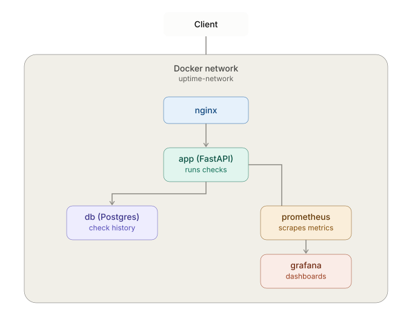

[](https://github.com/pchelbisson/Uptime-Checker/actions/workflows/docker-scan.yml/badge.svg?branch=main)



# Uptime Checker API

A minimal uptime-checker API built as a hands-on learning project to master professional Docker, container orchestration, and observability practices. The project follows an evolutionary path — going from a single isolated container to a complete production-like stack.

## Current Architecture Status

* **Backend:** FastAPI, HTTPX (resilient network exception handling, custom Prometheus metrics).
* **Reverse Proxy:** Nginx (traffic routing, rate limiting, SSL/security headers ready).
* **Database & Cache:** PostgreSQL (persistent storage for health check history).
* **Monitoring & Observability:** Prometheus (scraping `/metrics`), Grafana v11 (auto-provisioned dashboards & datasources).
* **Infrastructure & Containerization:** 
  * Docker Compose (multi-container orchestration, custom bridge network `uptime-network`).
  * Docker Best Practices: Multi-stage builds (`python:3.12-alpine`), non-root security execution (`appuser`), pinned base images, `.dockerignore` context optimization.

---

## API Endpoints

* `GET /health` — Simple health check endpoint (returns `{"status": "ok"}`).
* `GET /info` — Container metadata (returns runtime process uptime, python version, and internal container `hostname`).
* `GET /check?url=<url>` — Performs a synchronous HTTP request to the target URL, measures response time in milliseconds, and handles connection/DNS errors gracefully without dropping the application.
* `GET /db-check` — Verifies connectivity to the PostgreSQL database (returns `{"db_connected": true}` or `false` with an error message).
* `GET /history?url=<url>&limit=<n>` — Returns the most recent uptime checks for a given URL, ordered by most recent first (default `limit=20`).
* `GET /metrics` — Prometheus endpoint with check execution metrics (request count, latency, errors).

---

## Quick Start

To start the entire infrastructure stack (FastAPI App, PostgreSQL, Nginx, Prometheus, Grafana) using Docker Compose:

1. **Configure Environment Variables:**
   
  ```bash
  # Copy the example configuration file and adjust variables if needed:
  cp .env.example .env

  # Build and Run Containers:
  docker compose up -d --build

  # Verify API Endpoints:
  curl http://localhost/db-check
  curl "http://localhost/check?url=https://google.com"
  curl "http://localhost/history?url=https://google.com&limit=5"
  curl http://localhost/metrics
  # Grafana dashboards: http://127.0.0.1:3000 (admin credentials from .env)
  # Prometheus UI: http://127.0.0.1:9090
  ```
---

## Project Roadmap

- [x] **Level 1: Containerization Basics** - Single container setup, multi-stage build optimization, non-root user execution, layer trimming.

- [x] **Level 2: Orchestration & Networking** - Docker Compose environment, Nginx reverse-proxy, rate limiting, and environment-based configuration.

- [x] **Level 3: State & Scheduling** - PostgreSQL integration, background tasks worker, periodic service uptime checks history.

- [x] **Level 4: Optimization and Supply Chain Hygiene** - Multi-stage image optimization, Vulnerability scanning with Trivy in CI

- [x] **Level 5: Observability Stack** - Prometheus metrics export, Grafana dashboard visualization, application logging structure.

## Design Decisions: Infrastructure & Security

### 1. Reverse Proxy & Network Isolation (Level 2)
* **Decision:** The FastAPI application is completely isolated from the host network. The `ports` directive is removed from the `app` service in `docker-compose.yml`.
* **Rationale:** Security best practice. Only the Nginx container exposes port `80` to the outside world. All traffic to the application must pass through the proxy, eliminating direct scanning or bypassing of security controls.

### 2. Rate Limiting Configuration (Level 2)
* **Configuration:** `rate=5r/s`, `burst=3 nodelay`, `status=429`.
* **Rationale:** 
  * `rate=5r/s`: Protects the application threads from being overwhelmed by automated brute-force checking or DDoS loops.
  * `burst=3 nodelay`: Allows legitimate clients to execute a burst of up to 3 concurrent requests (e.g., when a dashboard UI requests status for multiple endpoints at once) without artificial latency (`nodelay`), but tightly drops any excessive spam.
  * `status=429`: Provides standard, semantically correct HTTP telemetry (`Too Many Requests`) instead of generic server errors (`503`).

### 3. Proxy Timeouts (Level 2)
* **Configuration:** `proxy_connect_timeout 3s;`, `proxy_read_timeout 3s;`.
* **Rationale:** If the internal Python application hangs or deadlocks due to an unhandled upstream network event, Nginx will wait no longer than 3 seconds before severing the connection and releasing worker threads. This prevents cascading failures across the proxy layer.

### 4. Environment Configuration & Templating (Level 2)
* **Decision:** Extracted all configurable runtime parameters (`NGINX_PORT`, `APP_PORT`, `RATE_LIMIT_RPS`, `RATE_LIMIT_BURST`) into a `.env` file (`.env.example` committed as a reference). Nginx dynamically renders `nginx.conf` at startup from `nginx.conf.template` via explicit `envsubst` in the Compose command.
* **Rationale:** 
  * Establishes a single source of truth for ports and rate-limiting across both Docker Compose orchestration and Nginx proxy configs.
  * Explicitly restricts `envsubst` to specified custom variables (`$RATE_LIMIT_RPS`, `$RATE_LIMIT_BURST`, `$APP_PORT`), avoiding corruption of Nginx internal directives (`$host`, `$remote_addr`).
  * Bypasses implicit Docker entrypoint script quirks, ensuring robust, deterministic configuration rendering at startup.

### 5. Database Persistence via Named Volume (Level 3)
* **Configuration:** `postgres_data:/var/lib/postgresql/data` (Docker Named Volume instead of a Bind Mount).
* **Rationale:** PostgreSQL requires strict POSIX file permissions (`chmod 700`, owner `postgres`) and high I/O throughput. Named Volumes are managed natively inside the Docker VM's Linux filesystem (ext4), bypassing the slow cross-OS filesystem translation layer (9p/virtiofs in WSL2) and eliminating FATAL: data directory has wrong ownership permission issues common with bind mounts on Windows hosts.

### 6. Advanced Database Healthcheck via `pg_isready` (Level 3)
* **Configuration:** `test: ["CMD-SHELL", "pg_isready -U ${POSTGRES_USER} -d ${POSTGRES_DB}"]`
* **Rationale:** Relying on a basic TCP-ping for port `5432` introduces a race condition; PostgreSQL binds to its socket and opens the port at the very start of its bootstrap phase—long before it finishes reading configs, initializing memory, or replaying WAL logs. A TCP check would report success prematurely, causing the application container to attempt a connection and crash with an authentication error. The native `pg_isready` utility performs a lightweight application-level handshake with the database server and returns an exit code of 0 only when the Postgres instance is fully operational and capable of executing SQL queries.

### 7. Database Initialization: Application Code vs. Docker Init Scripts (Level 3)
* **Chosen Approach:** Application-driven schema creation via SQL executing on FastAPI startup `(CREATE TABLE IF NOT EXISTS)`.
* **Rationale:** 
  * **Lifecycle Flexibility:** Scripts placed inside `/docker-entrypoint-initdb.d/` run only once—when the PostgreSQL container volume is entirely empty.
  * **Application Autonomy:** Executing `CREATE TABLE IF NOT EXISTS` within the FastAPI `lifespan` ensures that the application remains self-contained and environment-agnostic.
  * **Bridge to Migration Frameworks:** Handling initialization inside Python establishes the exact architectural pattern required for professional production workflows. 

### 8. Target URL Configuration: Environment Variables vs. Mounted Files (Level 3)
* **Chosen Approach:** Single environment variable string split via comma `(MONITORED_URLS)` inside the `.env` file.
* **Rationale:**
  * **Strict Twelve-Factor Alignment:** Storing the target list in `.env` adheres directly to the principle of keeping configuration strictly isolated from the application code and disk state.
  * **Zero-Volume Overhead:** Using a variable eliminates the need to configure, manage, and maintain additional Docker bind mounts or file volumes for the application container. This minimizes infrastructure footprint and removes potential cross-platform file permission bugs between host systems and runtime containers.
  * **Trivial Application Parsing:** Python handles comma-separated string parsing natively using standard string manipulation `(os.getenv("MONITORED_URLS", "").split(","))` or native `Pydantic` validation.

### 9. Choosing a base image (Alpine vs. Slim) (Level 4)
* **Chosen Approach:** Switching both build and runtime stages to `python:3.12-alpine`.
* **Rationale:** Rebuilt an equivalent slim-based image with identical dependencies (psycopg[binary], apscheduler, fastapi, httpx) for a fair comparison: 293MB (slim) vs 189MB (alpine) — a genuine 104MB (-35.5%) reduction. `psycopg[binary]` installs cleanly on Alpine without requiring gcc/musl-dev, since PyPI provides pre-built musllinux wheels.

### 10. Security Scanning with Trivy (Level 4)
* **Chosen Approach:** Dependencies are pinned to specific versions (`==`) to ensure build reproducibility.
* **Rationale:** Detecting new vulnerabilities is a CI task rather than a pinning task: `Trivy` scans the image on every push, and if a `HIGH` or `CRITICAL` vulnerability is found, the developer explicitly updates the specific version (via a code review, not automatically) and then locks in the new exact pin. This ensures the resulting image is always predictable, and updates are deliberate rather than a side effect of an accidental rebuild.

### 11. Metrics Exposure & Access (Level 5)
* **Decision:** Prometheus UI bound to `127.0.0.1:9090` only (local debugging), not exposed publicly. `/metrics` on the app is proxied through nginx without authentication.
* **Rationale:** For this project's scope, `/metrics` exposes only aggregate counters (check counts, response times) - no sensitive data. In a real production setup, this endpoint would sit behind basic auth or network policy restricting access to the monitoring subnet only.